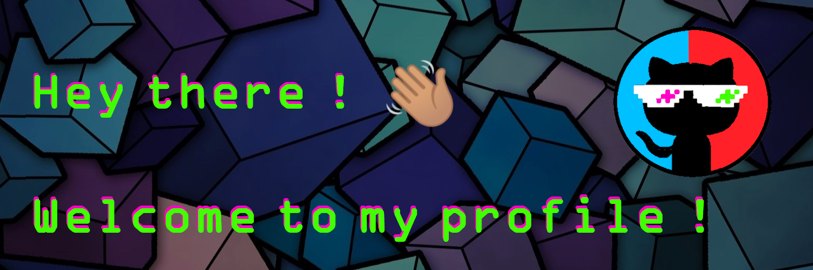

I'm a software engineer passionate about building great software. I've worked on projects of various scales, both solo and as part of a team. I'm keen to collaborate with passionate people on interesting projects.

Education is the basis for human and living development, and I'm always focused on this! ✊🏾 

**If you want to know more from me, visit my pages 💻:**

- [My page](http://phbomfim.dev/).
- [My developer blog](http://blog.phbomfim.dev/).
- [English](http://resume.phbomfim.dev) or [Portuguese](http://curriculo.phbomfim.dev/) resume versions.

**Or find me around the web 🌎:**

- [Linkedin profile](https://www.linkedin.com/in/phbomfim/)
- [StackOverFlow profile](https://pt.stackoverflow.com/users/86147/paulo-bomfim?tab=profile)
- [FreeCode Camp profile](https://www.freecodecamp.org/phbomfim)

 

